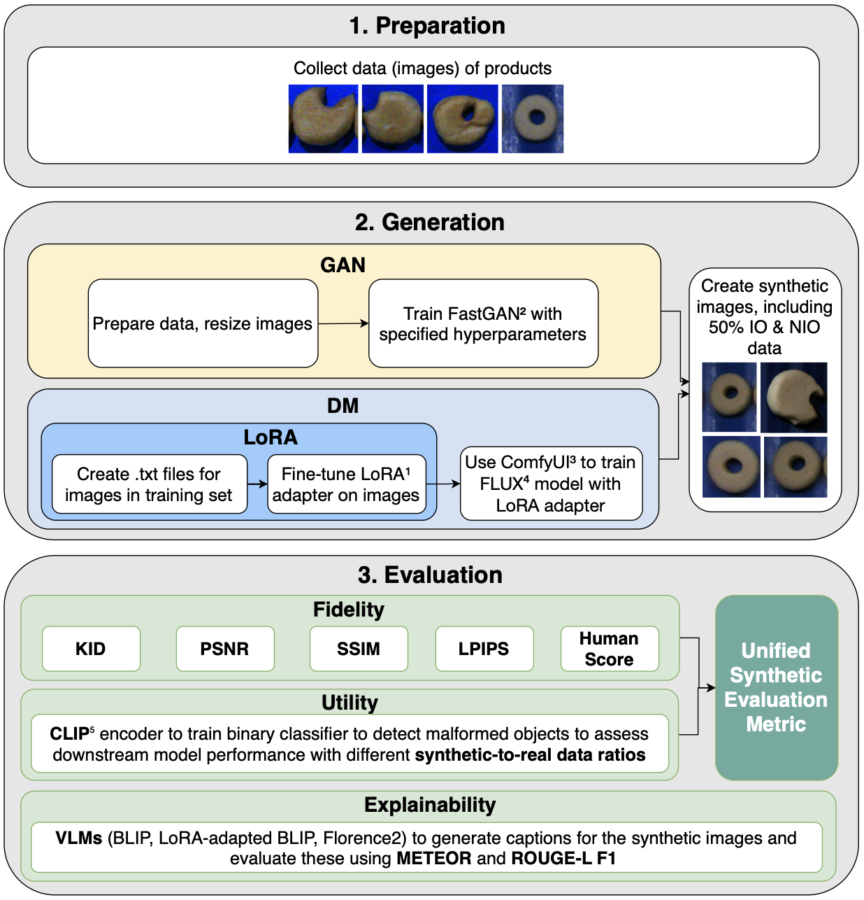

# Synthetic Image Generation and Evaluation Framework

This project provides a complete, end-to-end pipeline for evaluating and analyzing synthetic image data for industrial computer vision tasks. The workflow starts with raw image collection and finishes with a comprehensive set of performance metrics and plots comparing different generative models (GANs vs. DMs) and data compositions.



---
## Prerequisites

-   Python 3.9+
-   A configured virtual environment (`venv`).
-   All required packages installed via `pip install -r requirements.txt`.
-   A separate clone of the `wise-ft-clip` repository for training the classifiers (https://github.com/mlfoundations/wise-ft.git).

---
## Folder Structure

Before starting, your project should have a base structure for storing source data and receiving outputs.

```bash
├── comfyUIworkflows/       <-- JSON workflows for ComfyUI (e.g., FLUX, Florence-2)
├── data/
│   ├── real_donut/
│   │   ├── io/             <-- Real 'in order' donut images
│   │   └── nio/            <-- Real 'not in order' donut images
│   ├── synthetic_donut_dm/
│   │   ├── io/             <-- Synthetic DM 'in order' donut images
│   │   └── nio/            <-- Synthetic DM 'not in order' donut images
│   ├── synthetic_donut_gan/
│   │   ├── io/             <-- Synthetic GAN 'in order' donut images
│   │   └── nio/            <-- Synthetic GAN 'not in order' donut images
│   └── ... (folders for croissant data)
├── evaluation/
├── lora/                   <-- Stores LoRA model files
├── models/                 <-- Stores model files for different ratios and products
├── outputs/                <-- Stores LoRA model files
│   ├── caption_examples/   <-- Example captions generated by VLMs
│   ├── metrics/            <-- Metrics for different products
│   ├── plots/              <-- All plots for metrics
│   ├── reports/            <-- CSV files 
└── wise-ft-clip/           <-- external repository
```
- The comfyUIworkflows/ directory contains JSON files for ComfyUI, including workflows for training the FLUX generative model and running the Florence-2 captioner.

- The lora/ directory stores LoRA (Low-Rank Adaptation) files. To use them for image generation, you must place these files into your ComfyUI installation folder at ComfyUI/models/loras and ComfyUI/models/lora

---
## Experimental Workflow

The pipeline consists of 8 sequential steps.

### 1. Data Collection & Preparation
-   **Action:** Manually collect real "in order" (IO) and "not in order" (NIO) images for each product (e.g., donuts, croissants).
-   **Action:** Use your generative models (GAN, DM) to create corresponding sets of synthetic IO and NIO images.
-   **Outcome:** All source images are organized in the `data/` directory as shown in the structure above.

### 2. Create Training & Evaluation Datasets
-   **Script:** `evaluation/preparation/prepare_folders_clip_encoder.py`
-   **Purpose:** This script takes the source images and automatically generates the mixed-ratio datasets needed for training. It performs an 80/20 train/eval split to ensure no data leakage.
-   **Command:** Run this script for each product and generative model combination.

```bash
# Example for creating Donut DM datasets
python evaluation/preparation/prepare_folders_clip_encoder.py \
    --real-io-dir data/real_donut/io \
    --real-nio-dir data/real_donut/nio \
    --syn-io-dir data/synthetic_donut_dm/io \
    --syn-nio-dir data/synthetic_donut_dm/nio \
    --output-dir data/output/ \
    --product-id d \
    --model-id DM
```
Outcome: The data/output/ folder is populated with subfolders like train_50_50_DM_d/ and eval_50_50_DM_d/.

### 3. Train the Classifiers
- Tool: The wise-ft-clip repository

- Purpose: Train a separate classifier for each dataset created in the previous step.

- Command: For each dataset, run the training command. This must be repeated for all 10 combinations per product.

```bash
# Example for training on the 100% synthetic Donut DM dataset
python wise-ft-clip/src/wise_ft.py \
    --train_set train_100syn_DM_d \
    --eval_set eval_100syn_DM_d \
    --save=models/wiseft/ViTB16-100syn_DM_d_July \
    --data-location=/path/to/your/datasets_output/ \
    ... (other parameters)
```
- This wise_ft.py is not fully contained in this enironment due to the size and the computational complexity. To run this, you need to clone this repository: https://github.com/mlfoundations/wise-ft.git
- Outcome: A set of trained models are saved in the --save directory, each containing a checkpoint file (e.g., checkpoint_50.pt).
- Example: 
```bash
python wise-ft-clip/src/wise_ft.py \
    --train_set train_50_50_DM_cashew \
    --eval_set  eval_50_50_DM_cashew \
    --train-dataset=ImageSingleFolderLoader \
    --eval-datasets=ImageSingleFolderLoader \
    --epochs=50 \
    --lr=0.00003 \
    --wd=0.0001 \
    --batch-size=16 \
    --model=ViT-B/16 \
    --template=donut_template \
    --results-db=results_50_50_DM_cashew.json \
    --save=/wise-ft-clip/models/wiseft/ViTB16-50_50_DM_cashew \
    --data-location=/wise-ft-clip/data \
    --early_stop_min_iterations=0 \
    --classes_list_path /wise-ft-clip/class_names_list/classes_20250512_donuts.txt \
    --classnames_to_encode /wise-ft-clip/class_names_list/classes_20250512_donuts_encode.txt
    
```
- Sometimes you first need to run: ```bash export PYTHONPATH="$PYTHONPATH:$PWD" ```

### 4. Organize Checkpoints
**Important note**: Due to their large size, the final trained model checkpoint files (.pt) are not included in this repository. To run the evaluation pipeline (Steps 5 and beyond), you must first run the training step (Step 3) to generate these files and then manually place them into the models/ directory as described below.

- Action: This is a manual or scripted step to prepare for evaluation.

- Purpose: Copy the best checkpoint from each training run in Step 3 into a single models/ directory and rename it according to the convention ratio_model_product.pt.

- Example: Copy .../ViTB16-100syn_DM_d/finetuned/checkpoint_50.pt to models/100syn_DM_d.pt.

### 5. Evaluate Model Utility & Performance

This step evaluates the trained classifiers from multiple angles. It begins by calculating a comprehensive set of standard performance metrics and then uses those results to generate various visualizations and a business-oriented cost analysis.

#### 5.1. Calculate Core Metrics

-   **Script**: `evaluation/utility/utility_assessment.py`
-   **Purpose**: This is the primary evaluation script. It systematically loads each organized checkpoint from Step 4, runs inference on a consistent test set, and computes a full suite of classification metrics (Accuracy, Precision, Recall, F1-Score, ROC-AUC, etc.).
-   **Command**:
    ```bash
    # Example for evaluating all Donut models
    python -m evaluation.utility.utility_assessment \
        --models-dir models/ \
        --test-dir data/test/donut \
        --product donut
    ```
-   **Outcome**: The script generates detailed JSON files in the `outputs/metrics/<product>/` directory (e.g., `100syn_DM.json`). Each file contains the summary metrics and per-image predictions for one model. These files are the essential input for all subsequent analysis in this step. It also creates an aggregated `_summary_all_models.csv` for a quick overview.

#### 5.2. Visualize Performance & Analyze Costs

-   **Purpose**: This stage uses a collection of specialized scripts that take the JSON files from the previous step as input to create plots and conduct a cost-based comparison.
-   **Scripts & Commands**:
    -   **Plot Standard Metrics**: Create bar charts for metrics like F1-score, accuracy, and precision.
        ```bash
        python evaluation/utility/plot.py --product donut --model-type GAN
        ```
    -   **Plot Performance Curves**: Generate and overlay ROC and Precision-Recall curves to compare classifier trade-offs.
        ```bash
        python evaluation/utility/plot_curves.py --product donut --model-type GAN
        ```
    -   **Analyze Economic Cost**: Calculate and visualize a custom cost score based on a configurable cost matrix (e.g., making False Negatives much more costly than False Positives).
        ```bash
        python evaluation/utility/cost_comparison.py --product donut --model-type GAN --cost-fn 10 --cost-fp 1
        ```
-   **Outcome**: This step populates the `outputs/plots/` directory with a rich set of visualizations (`.png` files), including bar charts for each metric, ROC/PR curves, and the final cost comparison plot. This provides a complete visual summary of model performance.
### 6. Calculate Fidelity Metrics
-   **Script**: `evaluation/fidelity/fidelity_scores.py`
-   **Purpose**: This script reads the JSON files created in Step 5 and enriches them by adding quantitative image **fidelity metrics** and **human evaluation scores**. It calculates a suite of metrics comparing the real and synthetic image sets and processes a separate CSV of human ratings to derive a `human_score` for each experiment, including weighted scores for mixed-ratio datasets.
-   **Fidelity Assessment**: For the calculation of image fidelity metrics, the script resizes images to specific, uniform dimensions prior to analysis to ensure consistency.
    -   For **Kernel Inception Distance (KID)**, all images are resized to `299x299` pixels.
    -   For **Peak Signal-to-Noise Ratio (PSNR)**, **Structural Similarity Index Measure (SSIM)**, and **Learned Perceptual Image Patch Similarity (LPIPS)**, a consistent dimension of `256x256` pixels is used.
-   **Command**:
    ```bash
    python -m evaluation.fidelity.fidelity_scores
    ```
-   **Outcome**: The existing JSON files in the `outputs/metrics/` directory are updated. Each file's `summary` object is now complete, containing both the classification **utility** metrics from Step 5 and the **fidelity** and **human_score** metrics calculated in this step.
### 7. Explainability

This stage focuses on understanding the content of the generated images using **Vision-Language Models (VLMs)**. The workflow involves generating descriptive captions with specific tools, performing a comprehensive quantitative analysis, visualizing the results, and collecting qualitative examples.

#### 7.1 Caption Generation

-   **Goal**: The first step is to generate a text caption for every image in the dataset (real, synthetic, IO, and NIO). The output of this step is a `.txt` caption file saved alongside each image, which serves as the primary input for the analysis scripts.
-   **Tool: `generate_captions_BLIP.py` (Base Model)**
    -   **Purpose**: An end-to-end script for the base **BLIP** model. It generates captions using `Salesforce/blip-image-captioning-large` and performs its own initial similarity analysis.
    -   **Command**: `python evaluation/explainability/generate_captions_BLIP.py`
    -   **Outcome**: Creates `.txt` caption files and produces two reports: `captions_BLIP.csv` and `caption_similarity_BLIP.csv`.
-   **Tool: `generate_captions_BLIP_LoRA.py` (Fine-Tuned Model)**
    -   **Purpose**: Generates captions using a smaller base BLIP model that has been fine-tuned with **LoRA (Low-Rank Adaptation)**. It loads a pre-trained LoRA adapter to enhance model performance.
    -   **Prerequisites**: Requires a **CUDA-enabled GPU** and is not compatible with Apple Silicon due to the `bitsandbytes` dependency.
    -   **Command**: `python evaluation/explainability/generate_captions_BLIP_LoRA.py`
    -   **Outcome**: Saves the generated captions as `.txt` files in the `outputs/BLIP-LoRA/` directory.
-   **Tool: Florence-2 ComfyUI Workflow**
    -   **Purpose**: A provided ComfyUI workflow (`evaluation/explainability/Florence_Captioner.json`) is used to generate captions with the **Florence-2** model.

#### 7.2 Comprehensive Quality and Similarity Analysis

-   **Script**: `evaluation/explainability/evaluate_models.py`
-   **Purpose**: This is the primary analysis script. After captions have been generated for all VLMs, this script runs a comprehensive evaluation by reading all `.txt` caption files to:
    1.  **Calculate Summary Statistics**: Computes average caption length and defect keyword frequency.
    2.  **Perform Pairwise Similarity Analysis**: Compares captions from real and synthetic images using a full suite of NLP metrics (BLEU, ROUGE, BERTScore, TFIDF, etc.).
-   **Command**: `python evaluation/explainability/evaluate_models.py`
-   **Outcome**: Creates two main CSV files in `outputs/reports/` which are used for the final plotting step:
    -   `summary.csv`: Contains summary statistics for each VLM.
    -   `pairwise_similarity.csv`: Contains the detailed, multi-metric similarity scores.

#### 7.3 Visualize Captioning Results

-   **Script**: `evaluation/explainability/plot_captions_comparison.py`
-   **Purpose**: This script visualizes the results from the analysis step. It reads the `summary.csv` and `pairwise_similarity.csv` files to generate a series of bar plots that compare the performance of each VLM across all evaluated metrics.
-   **Command**: `python evaluation/explainability/plot_captions_comparison.py`
-   **Outcome**: A series of `.png` plots are saved to the `outputs/plots/captions/` directory, each visualizing a different metric (e.g., `summary_avg_caption_length.png`, `similarity_BERTScore_F1.png`).

#### 7.4 Generate Qualitative Examples

-   **Script**: `evaluation/explainability/generate_caption_examples.py`
-   **Purpose**: A utility script to quickly gather a single synthetic NIO (`syn_nio`) image and its caption from each VLM for easy qualitative review or for inclusion in reports.
-   **Command**: `python evaluation/explainability/generate_caption_examples.py`
-   **Outcome**: Populates the `outputs/caption_examples/` directory with one image-caption pair per VLM, prefixed with the model's name for easy identification.

### 8. Final Analysis and Plotting

-   **Script**: `evaluation/fused_metric/unified_metric.py`

-   **Purpose**: This script serves as the final, all-in-one analysis and visualization stage of the pipeline. It aggregates all the pre-computed metrics from the individual JSON summary files, normalizes them, and fuses them into composite scores for a holistic comparison of the generative models. Key steps include:
    -   **Load & Unify**: Recursively finds and loads all `.json` summary files into a single, unified DataFrame.
    -   **Normalize Metrics**: Applies min-max normalization to all raw metrics (e.g., PSNR, KID, accuracy) to bring them to a common [0, 1] scale, making them comparable.
    -   **Fuse Scores**: Calculates three different types of fused scores to provide a comprehensive evaluation:
        1.  A **`composite_score`** based on a weighted average of the normalized metrics.
        2.  A **`pca_score`** derived from the first principal component of the data.
        3.  A **`human_fused`** score from a Random Forest model trained to predict human ratings from the normalized metrics.
    -   **Generate Plots**: Creates a comprehensive set of visualizations, including a correlation heatmap, t-SNE embeddings, and bar charts comparing the composite scores across different models, products, and data ratios.

-   **Command**:
    ```bash
    # Run the final analysis to create fused scores and all plots
    python -m evaluation.fused_metric.unified_metric
    ```

-   **Outcome**: This single script produces all the final outputs for the project:
    -   A final summary file at `outputs/reports/unified_metric_scores.csv`, containing the complete dataset with all raw, normalized, and fused scores.
    -   The `outputs/plots/` directory is populated with all result visualizations, ready for reporting.

### Acknowledgements
This code was developed during my Master thesis. 

Code last updated: 12.08.2025

Author: Lisa Stuch